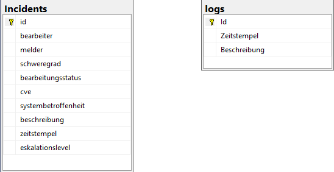
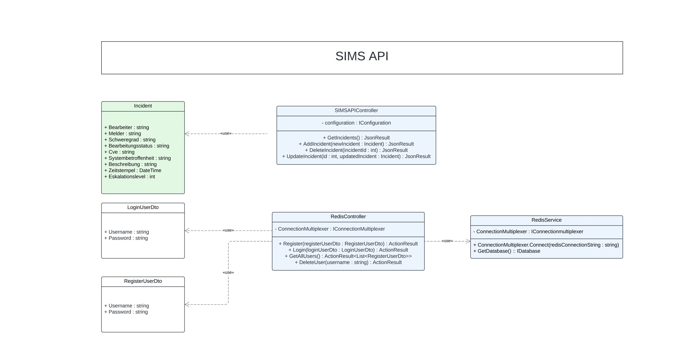

# SIMSAPI Projekt

 

## Inhaltsverzeichnis

- [Einleitung](#einleitung)
- [Systemvoraussetzungen](#systemvoraussetzungen)
- [Funktionen und Features](#funktionen-und-features)
  - [Benutzerverwaltung](#benutzerverwaltung)
  - [Incident-Management](#incident-management)
  - [Frontend](#frontend)
- [Installation und Setup](#installation-und-setup)
- [Architektur und Diagramme](#architektur-und-diagramme)
  - [ER-Diagramm](#er-diagramm)
  - [Klassendiagramm](#klassendiagramm)
- [Ergebnisse der SAST-Prüfung](#ergebnisse-der-sast-prüfung)
- [Mitwirkende](#mitwirkende)
- [Roadmap](#roadmap)
- [Lizenz](#lizenz)

## Einleitung

SIMSAPI ist eine Anwendung zur Verwaltung von Vorfällen, die in einer Microservice-Architektur auf .NET aufbaut und mehrere Technologien zur Datenspeicherung und -verarbeitung verwendet. Sie bietet eine RESTful API für das Backend, ein Blazor-Frontend zur Benutzerinteraktion und nutzt SQL und Redis für die Datenspeicherung und -verwaltung. Die Anwendung wird in Docker-Containern bereitgestellt, um eine einfache Bereitstellung und Skalierbarkeit zu ermöglichen.

**GitHub-Repository:** [SIMSAPI Repository](https://github.com/julianwagnerfh/SIMS_JulianWagner)  

Das Ziel von SIMSAPI ist es vor allem die Verwaltung und Analyse von Vorfällen bereitzustellen.

## Systemvoraussetzungen

Für den erfolgreichen Betrieb von SIMSAPI sind folgende Systemvoraussetzungen erforderlich:

- **Betriebssystem**: Windows
- **.NET Runtime**: .NET 8.0 oder höher
- **Docker**: Version 20.10 oder höher, zum Ausführen der Microservices
- **Datenbanken**:
  - **Microsoft SQL Server**: Zum Speichern und Verwalten der Vorfall-Daten
  - **Redis Server**: Zum Speichern der Benutzerdaten und für schnelle Datenzugriffe
  
Es wird empfohlen, das System auf einem leistungsstarken PC auszuführen.

## Funktionen und Features

### Benutzerverwaltung

Die Benutzerverwaltung nutzt Redis als schnelle Datenbank. Folgende Funktionen stehen zur Verfügung:

- **Registrierung**: Neue Benutzer können sich registrieren. Die Zugangsdaten werden verschlüsselt in Redis gespeichert.
- **Login**: Authentifizierte Benutzer können sich anmelden und erhalten Zugriff auf die relevanten Funktionen.
- **Benutzerauflistung**: Administratoren können eine Liste aller registrierten Benutzer einsehen.
- **Benutzerlöschung**: Einzelne Benutzer können dauerhaft aus dem System entfernt werden. (mittels einer User-Id)

### Incident-Management

Die Verwaltung von Vorfällen ist ein zentraler Bestandteil von SIMSAPI und nutzt eine SQL-Datenbank zur Speicherung und Verwaltung der Vorfallsdaten. Die Funktionen umfassen:

- **CRUD-Operationen für Vorfälle**: Erstellen, Anzeigen, Bearbeiten und Löschen von Vorfällen.

### Frontend (in aktuellen Version nach docker-compose nicht mehr möglich)

Das Blazor-Frontend bietet eine Benutzer Oberfläche zur Interaktion mit der SIMSAPI-Anwendung. Die wichtigsten Seiten umfassen:

- **Registrierung**: Neue Benutzer können sich über die Benutzeroberfläche registrieren.
- **Login-Seite**: Authentifizierung der Benutzer, um Zugriff auf die Vorfallsverwaltung zu erhalten.
- **Home**: Übersicht über aktuelle Vorfälle und Benutzerstatistiken
- **Vorfallverwaltung**: Benutzer können Vorfälle erstellen, aktualisieren und verwalten.

## Installation und Setup

### 1. Projekt aus dem Git-Repository klonen
Klonen Sie das Projekt-Repository und wechseln Sie in das Projektverzeichnis:
```bash
git clone https://github.com/julianwagnerfh/SIMS_JulianWagner
cd simsapi
```

### 2. NuGet-Pakete installieren
In Redis Controller:
- using Microsoft.AspNetCore.Http;
- using Microsoft.AspNetCore.Mvc;
- using StackExchange.Redis;
- using BCrypt.Net;

In SIMSAPIController
- using Microsoft.AspNetCore.Http;
- using Microsoft.AspNetCore.Mvc;
- using SIMSAPI.Models;
- using System.Data;
- using System.Data.SqlClient;

Installiere alle sonstigen Nuget-Pakete, die in den einzelnen C-Sharp Klassen (.cs) ersichtlich sind.

### 3. Docker-Container starten
Kompiliere die Compose-File und stelle sicher dass alle 4 container laufen:

Die Anwendung wird über Docker-Compose gestartet, um die einzelnen Komponenten als Microservices auszuführen: Docker Desktop starten. Docker Compose Kompilieren (Starten im z.B. Debug).

Folgende File ist bereits im Code enthalten und wird zum Starten benötigt:
```bash
version: '3.4'

services:
  simsapi:
    image: ${DOCKER_REGISTRY-}simsapi
    build:
      context: .
      dockerfile: SIMSAPI/Dockerfile
    networks:
      - sims-network

  simsfrontend:
    image: ${DOCKER_REGISTRY-}simsfrontend
    build:
      context: .
      dockerfile: SIMSFrontend/Dockerfile
    networks:
      - sims-network

  sql1:
    image: mcr.microsoft.com/mssql/server:2019-latest
    container_name: sql1
    environment:
      - ACCEPT_EULA=Y
      - MSSQL_SA_PASSWORD=Adm1234!
    ports:
      - "1433:1433"
    expose: 
      - 1433
    volumes:
      - /c/Users/juliw/sql_data:/var/opt/mssql
    networks:
      - sims-network

  redis:
    image: redis:latest
    container_name: redis
    ports:
      - "6379:6379"
    networks:
      - sims-network

networks:
  sims-network:
    external: true

```

Es muss Docker-Compose ausgewählt werden beim Kompilieren. 

Im Code wird die Verbindung zu Redis und zu SQL hergestellt. 
Mit diesem Befehl einen lokalen SQL Server erstellen:
```bash
docker run -e "ACCEPT_EULA=Y" -e "MSSQL_SA_PASSWORD=Adm1234!" -p 1433:1433 --name sql1 --hostname sql1 -v c:/docker/Database:/var/opt/mssql/data -d
mcr.microsoft.com/mssql/server:2022-latest
```

Redis Container erstellen:
```bash
docker run -d --name redis -p 6379:6379 redis
```

Stets im Docker Desktop sicherstellen, dass alle 4 Container laufen.

Docker Support (Dockerfile) ist bereits hinzugefügt bei SIMSAPI und SIMSFrontend. 

### 4. SQL-Datenbank vorbereiten
Stellen Sie sicher, dass die SQL-Datenbank korrekt konfiguriert ist und die notwendigen Tabellen (Incident-Tabelle und Logs) bereitstellt.
Erstellen der Incidents-Tabelle mit diesem Skript in SSMS ausführen:
```bash
USE IncidentFrontendApp;

Create table dbo.Incidents (
    id INT PRIMARY KEY Identity(1,1),   
    bearbeiter VARCHAR(255),            
    melder VARCHAR(255),               
    schweregrad VARCHAR(255), 
    bearbeitungsstatus VARCHAR(255), 
    cve VARCHAR(50),                     -- CVE (Common Vulnerabilities and Exposures) Referenz
    systembetroffenheit VARCHAR(255),                 
    beschreibung VARCHAR(255),                   
    zeitstempel Datetime2(7), 
    eskalationslevel INT       -- Eskalationslevel, z.B. 1, 2, 3 für unterschiedliche Benutzer
)

INSERT INTO dbo.Incidents (bearbeiter, melder, schweregrad, bearbeitungsstatus, cve, systembetroffenheit, beschreibung, zeitstempel, eskalationslevel)
VALUES ('Max Mustermann', 'Anna Müller', 'hoch', 'offen', 'CVE-2023-1234', 'Webserver-01', 'Unautorisierter Zugriff entdeckt', '2024-10-15 10:00:00', 1);

```
Erstellen der Logs Tabelle in SSMS: 
```bash
CREATE TABLE dbo.logs (
    id INT PRIMARY KEY IDENTITY(1,1), -- Automatische ID-Generierung
    zeitstempel DATETIME NOT NULL,     -- Zeitstempel für Logs
    beschreibung NVARCHAR(MAX) NOT NULL -- Beschreibung des Logs
);

-- Einfügen von Testdaten in die Tabelle
INSERT INTO dbo.logs (id, zeitstempel, beschreibung)
VALUES
    (1, GETDATE(), 'Logeintrag 1: System gestartet.')
```

### 5. Anpassen der Connection Strings
In der appsettings.json-Datei der API können die Con. Strings für deine SQL- und Redis-Server angepasst werden (v.a. Name; auch in Compose-File Namen usw. anpassen):
```bash
"ConnectionStrings": {
    "SIMSAPIConnection": "Server=sql1;Database=IncidentFrontendApp;User Id=sa;Password=Adm1234!;Trusted_Connection=true;TrustServerCertificate=True;",
    "redisConnectionString": "redis:6379"
}
```
## Architektur und Diagramme

### Datenbankdiagramm
Das folgende DB-Diagramm zeigt die Datenbankstruktur von SIMSAPI:



### Klassendiagramm
Das Klassendiagramm stellt die wichtigsten Klassen und deren Beziehungen innerhalb des Systems dar:



## Ergebnisse der SAST-Prüfung

In aktuellen Version noch nicht durchlaufen

## Mitwirkende

- **Julian Wagner** - Entwickler
- **Erika Mustermann** - Testerin und Technischer Support
- **John** - DevOps-Ingenieur

## Roadmap

Mögliche zukünftige Versionen sind:

### Version 4.1:
- Einführung eines Rollenkonzepts zur Benutzerverwaltung
- Erweiterte Such- und Filteroptionen im Incident-Management
- Optimierung der Datenbankabfragen für höhere Effizienz

### Version 4.2:
- Mehrsprachigkeit für die Benutzeroberfläche
- Integration von E-Mail-Benachrichtigungen

### Version 4.3:
- Unterstützung für mobile Geräte
- Nachverfolgung aller Benutzeraktivitäten im Log

## Lizenz

SIMSAPI steht unter der [MIT Lizenz](./LICENSE). Sie sind berechtigt, die Software frei zu verwenden, zu kopieren, zu modifizieren und zu verbreiten.
